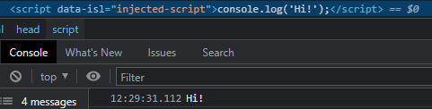
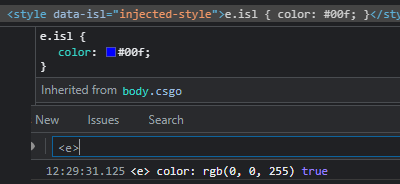

### InjectionService

Provide ways to inject scripts or css with extensions on manifest V3

---

##### Setup

The InjectionServiceLib should be put first as `document_start` content script.
```JSON
{
    "js": [
        "InjectionServiceLib.js"
    ],
    "matches": [ "..." ],
    "run_at": "document_start"
}
```
Any content script that requires the InjectionServiceLib should come immediately after.

---

##### Code Injection

Example:
```JavaScript
InjectionServiceLib.injectCode(`console.log('Hi!')`);
// OR ---
InjectionServiceLib.injectCode(`console.log('Hi!')`, 'head');

// You can also choose to append to <body> instead
InjectionServiceLib.injectCode(`console.log('Hi!')`, 'body');
```


---

##### CSS Injection

CSS always gets appended to the &lt;head&gt; element. <br>
Example:
```JavaScript
InjectionServiceLib.injectCSS('e.isl { color: #00f; }');
```


---

##### Settings

* `encode_content: boolean` <br>
`true` by default, in the case you have code that contains template strings, 
or other special formatting (html/xml), this setting should be kept enabled. <br>
You can set this before any `injectCode` or `injectCSS` call, but that only applies
if the onReady has completed, e.g. `document_end`, before that the state applies to all injections.
```JavaScript
InjectionServiceLib.encode_content = true | false;
```

* `append_on_document: boolean` <br>
This setting only applies to `injectCode` and `injectCSS`, this basically tells
the InjectionServiceLib if the injection anchor needs to be appended on the document. <br>
Default is `false`, only change this if you are having issues with code injection.
```JavaScript
InjectionServiceLib.append_on_document = false | true;
```

---

##### onReady

The `onReady` function provides a way to know when the InjectionServiceLib can inject scripts.
You can also choose to execute or run your own actions at this time. The callback / event gets
triggered almost immediately after the base document (e.g. &lt;head&gt; and &lt;body&gt;) are available.
```JavaScript
InjectionServiceLib.onReady(function() { /*magic code*/ });
```
Alternatively you can also listen to the event `EVENT_ISL_READY` directly. <br>
Note: This only fires <u>***once***</u> when the page is loaded initially, you are better
off adding your event handler to `onReady` that executes even after the page was loaded.
```JavaScript
window.addEventListener('EVENT_ISL_READY', function() { /*magic code*/ });
```
